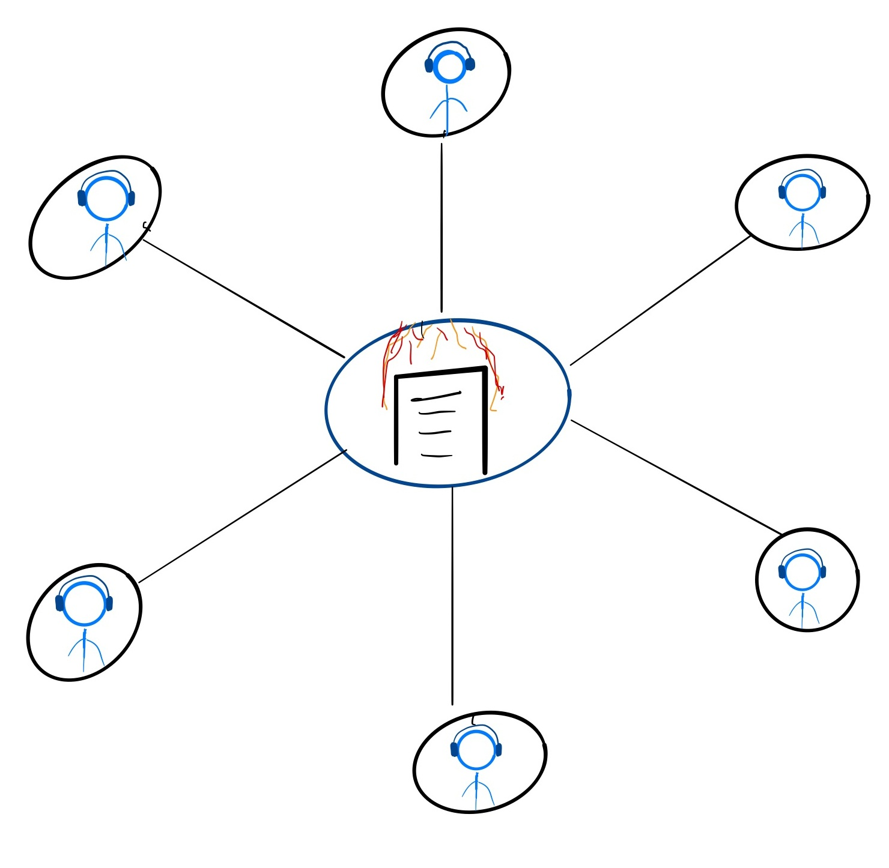

# Netcoding 101

---

# Netcoding 101

#### Andrés Millán y Ricardo Ruiz

---

> *Gestionar una partida significa gestionar entidades viviendo en instantes de tiempo distintos. Únicamente sabes dónde está su sombra del pasado.*

---

# Overtwatch

---
<!-- _backgroundColor: white -->

Es un videojuego de disparos en primera persona desarollado por *Blizzard*. Está enfocado al competitivo.

---

# Algunos conceptos básicos

---

#### Hablaremos de lo siguiente:

- Modelos de red
- Ping
- Routing
- Simulación
- Frecuencia de actualización / tickrate
- Pérdida de paquetes

---

# Modelos de red

---

## Servidores dedicados

<!-- _backgroundColor: white -->

---

Casi todos los juegos utilizan este modelo.

---

Casi todos los juegos utilizan este modelo.
Es la forma más cómoda para que los desarrolladores tengan un ambiente controlado.

---

## Peer to Peer

<!-- _backgroundColor: white -->

---

**P2P** se usa generalmente usado en **juegos de lucha**

---

Muy dependiente de la conexión de cada jugador

---

---

## Client hosted

<!-- _backgroundColor: white -->

---

*Overwatch* utiliza **servidores dedicados**

---

## Ping

---

## Ping

Latencia entre el servidor y el cliente (milisegundos).

---

Para medirla, el cliente envía una señal *ICMP echo request*, y el servidor responde a la petición.

De esta forma, se calcula el tiempo que tarda un paquete en enviarse del cliente al servidor y volver.

---

## Routing

---

Intentaremos trazar la ruta más rápida al servidor

---

## Simulación

---

### Simulación
Es la instancia de una partida del juego. Es decir; el conjunto de personajes, lógica y físicas que se ejecuta en tu cada máquina.

---

Todos los clientes y el servidor tienen su propia simulación. Es básico para que podamos jugar.

---

## Tickrate

---

### Tickrate
Es la frecuencia con la que el servidor y el cliente traspasan información. Cuanto mayor es el tickrate, más precisa la sincronización.

---

En el caso de Overwatch, el tickrate es de 60Hz (16.6ms).

---

---

## Pérdida de paquetes

---

### Pérdida de paquetes
El traspaso de información no es perfecto. Podríamos perder inputs por el camino.

---

---

**No nos lo podemos permitir en un juego competitivo.**

Veremos cómo mitigarlo.

---

# De vuelta a Overwatch

---

El juego necesita ser optimizado al máximo. El competitivo es exigente y tiene detrás una gran inversión monetaria.

---

Estudiaremos las **técnicas** que utiliza el juego para crear una buena experiencia de juego.