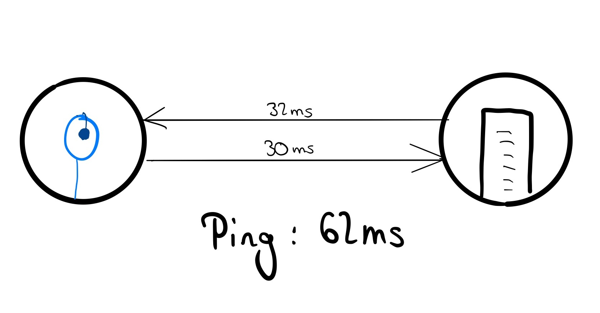

# Netcoding 101

---

# Netcoding 101

#### Andrés Millán y Ricardo Ruiz

---

> *Gestionar una partida significa gestionar entidades viviendo en instantes de tiempo distintos. Únicamente sabes dónde está su sombra del pasado.*

---

# Overtwatch

---
<!-- _backgroundColor: white -->

Es un videojuego de disparos en primera persona desarollado por *Blizzard*. Está enfocado al competitivo.

---

# Modelos de red

---

## Servidores dedicados

<!-- _backgroundColor: white -->

---

## Peer to Peer

<!-- _backgroundColor: white -->

---

## Client hosted

<!-- _backgroundColor: white -->

---

*Overwatch* utiliza **servidores dedicados**

---

# Algunos conceptos básicos

---

#### Hablaremos de lo siguiente:
- Ping
- Routing
- Simulación
- Frecuencia de actualización / tickrate
- Pérdida de paquetes

---

## Ping

---

## Ping

Latencia entre el servidor y el cliente (milisegundos).

---

Para medirla, el cliente envía una señal *ICMP echo request*, y el servidor responde a la petición.

De esta forma, se calcula el tiempo que tarda un paquete en enviarse del cliente al servidor y volver.

---

## Routing

---

Intentaremos trazar la ruta más rápida al servidor

---

## Simulación
