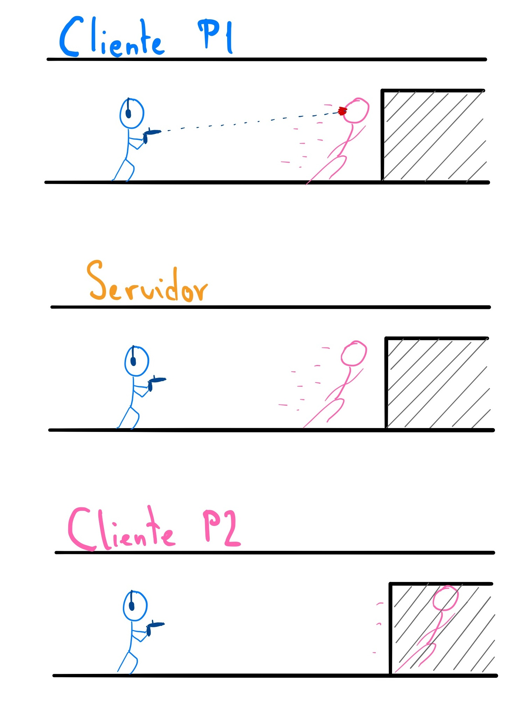
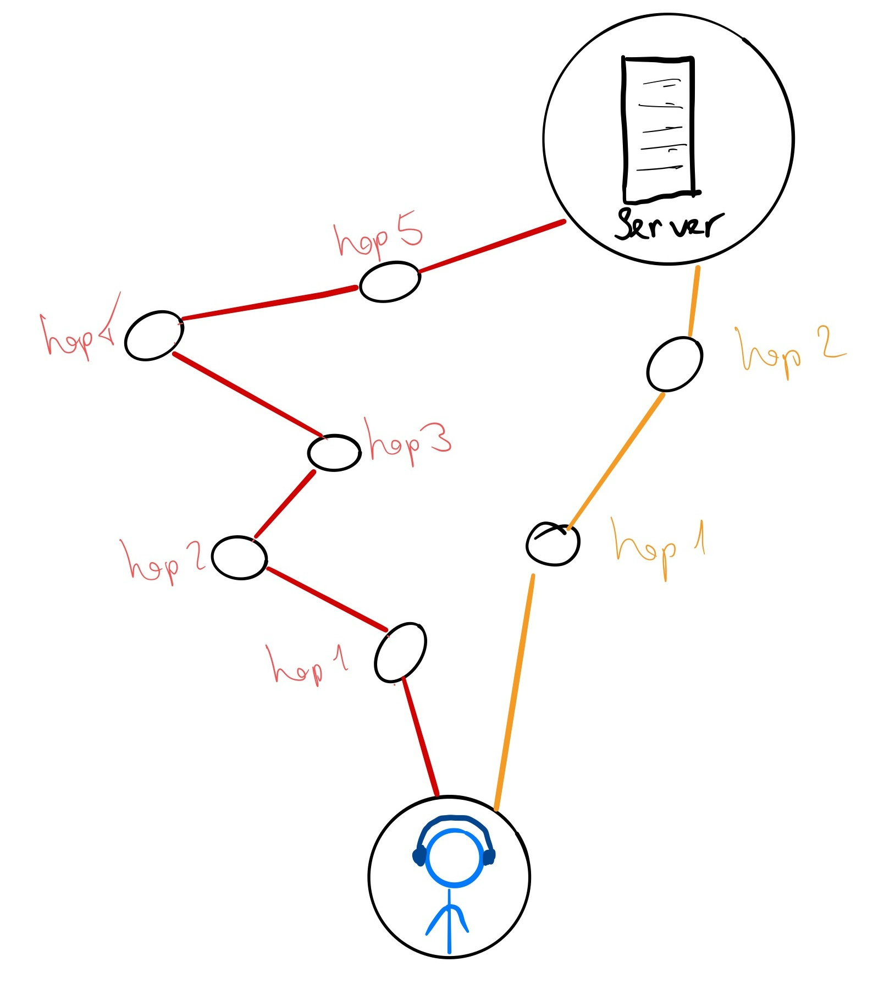
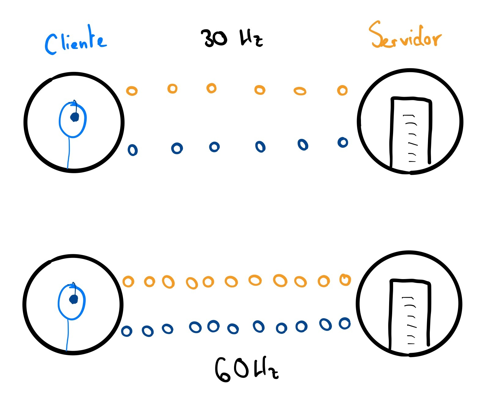
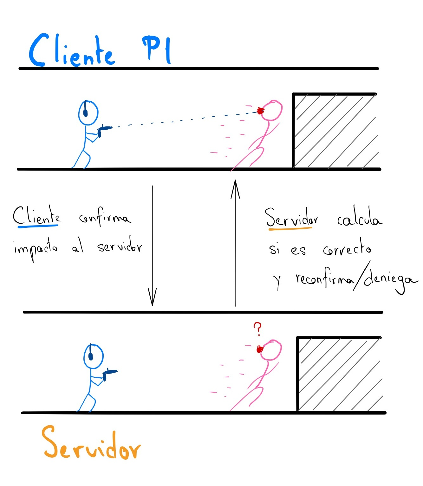
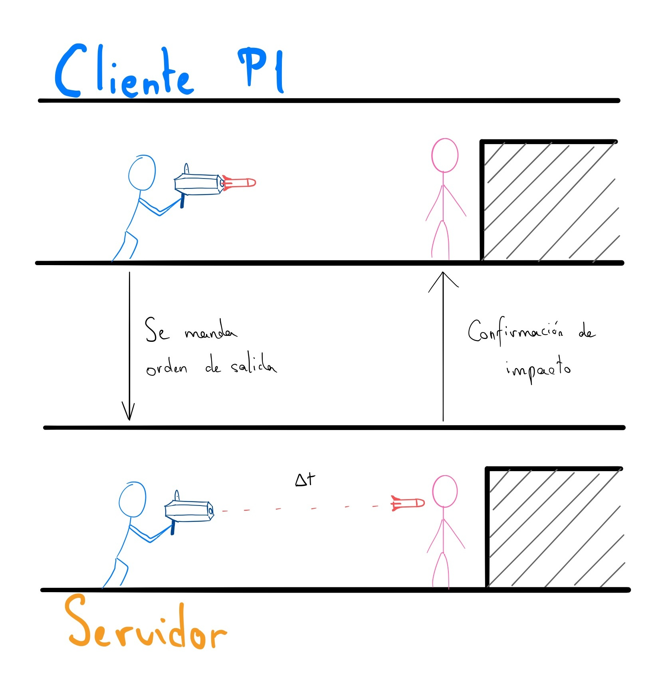

# Netcoding 101

---

# Netcoding 101

#### Andrés Millán y Ricardo Ruiz

---

> *Gestionar una partida significa gestionar entidades viviendo en instantes de tiempo distintos. Únicamente sabes dónde está su sombra del pasado.*

---

# El problema de la interacción jugador con jugador

---

¿Cómo **sincronizamos** los clientes?

---

<video src="./video/BF.mp4" controls width="100%"></video>

---

Estudiaremos las **técnicas** que utilizan los desarrolladores para crear una buena experiencia de juego.

---

# Overtwatch

---
<!-- _backgroundColor: white -->

Es un videojuego de disparos en primera persona desarollado por *Blizzard*. Está enfocado al competitivo.

---

---

# Algunos conceptos básicos

---

#### Hablaremos de lo siguiente:

- Modelos de red
- Ping
- Routing
- Simulación
- Frecuencia de actualización / tickrate
- Pérdida de paquetes

---

# Modelos de red

---

## Servidores dedicados

<!-- _backgroundColor: white -->

---

Muchos juegos utilizan este modelo.

---

Muchos juegos utilizan este modelo.
Es la forma más cómoda para que los desarrolladores tengan un ambiente controlado.

---

## Peer to Peer

<!-- _backgroundColor: white -->

---

**P2P** se usa generalmente usado en **juegos de lucha**.

---

Muy dependiente de la conexión de cada jugador.

---

---

## Client hosted

<!-- _backgroundColor: white -->

---

*Overwatch* utiliza **servidores dedicados**

---

## Ping

---

## Ping

Latencia entre el servidor y el cliente (milisegundos).

---

Para medirla, el cliente envía una señal *ICMP echo request*, y el servidor responde a la petición.

De esta forma, se calcula el tiempo que tarda un paquete en enviarse del cliente al servidor y volver.

---

## Routing

---

Intentaremos trazar la ruta más rápida al servidor

---

## Simulación

---

### Simulación
Es la instancia de una partida del juego. Es decir; el conjunto de personajes, lógica y físicas que se ejecuta tu cada máquina.

---

Tanto los cleintes como el servidor tienen su propia simulación. Es básico para que podamos jugar.

---

## Tickrate

---

### Tickrate
Es la frecuencia con la que el servidor y el cliente traspasan información. Cuanto mayor es el tickrate, más precisa la sincronización.

---

En el caso de Overwatch, el tickrate es de 63Hz (15.87ms).

---

---

## Pérdida de paquetes

---

### Pérdida de paquetes
El traspaso de información no es perfecto. Podríamos perder información por el camino.

---

---

**No nos lo podemos permitir en un juego competitivo.**

Veremos cómo mitigarlo.

---

# De vuelta a Overwatch

---

El juego necesita ser optimizado al máximo. El competitivo es exigente y tiene detrás una gran inversión monetaria.

---

Veamos las **técnicas de mitigación de latencia**

---

Hay dos **tipos de daño** en el juego

---

Hay dos **tipos de daño** en el juego:

- **Hitscan**
- **Proyectiles**

---

## Hitscan

El cliente traza un rayo desde el personaje hasta el objetivo. Si se encuentra la cruceta en el modelo, envía al servidor la confirmación del daño.

---

El servidor debe confirmar que es correcto.

---

## Proyectiles

El cliente envía la señal de que un determinado proyectil se ha lanzado. Tras esto, la distancia de viajado, daño, impacto, y todos los cálculos necesarios se realizan en la simulación del servidor.

---

---

# Favour the shooter

---

### Favour the shooter

El servidor, en general, favorecerá al atacante que ha disparo. Esto lo podemos ver en el vídeo de antes.

---

Esto, sin embargo, puede ser **frustrante para la víctima**. Para ello, se mitigan sus efectos de la siguiente manera:

---

- **Extrapolación**

- **Interpolación del delay**

- **Buffer de 4 últimos comandos** de los clientes

- **Mitigación del daño**

---

# Extrapolación

A partir de ciertos milisegundos de retardo, se deja de favorecer al atacante. Esto se hace para que no te maten jugadores con mucho ping en situaciones imposibles.

---

# Interpolación del delay

La simulación del servidor va atrasada una update rate. Esto hace que se conozca información futura de lo que los jugadores (si es que es posible)

---

Además, los movimientos que ve el servidor no son continuos. En el proceso de cálculo se suavizan.

---

# Mitigación del daño

Ciertas habilidades pueden anular el daño que los jugadores puedan reducir. El servidor recalculará todo lo necesario para evitar disonancias entre clientes.
