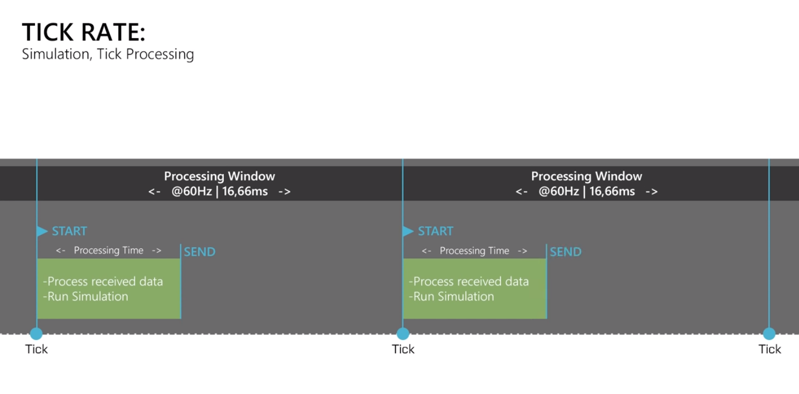

# 
 Introducción al netcoding 

*
 Por Andrés Millán Muñoz y Ricardo Ruiz 
*

En este documento, investigaremos el funcionamiento de un servidor de un juego online. Analizaremos el netcode de un juego online PvP (Player versus Player): qué tipo de conectividad se ofrece, cómo se gestiona la latencia y la pérdida de paquetes, interpolación de cliente/servidor...
Todos estos conceptos los ilustraremos mediante **Overwatch**

> *Gestionar una partida implica gestionar personas viviendo en instantes de tiempo distintos. Únicamente puedes saber dónde está su sombra del pasado.*

<!-- @import "[TOC]" {cmd="toc" depthFrom=2 depthTo=6 orderedList=false} -->

<!-- code_chunk_output -->

- [Modelos de red](#modelos-de-red)
    - [Servidores dedicados](#servidores-dedicados)
    - [Peer to Peer](#peer-to-peer)
    - [Client Hosted](#client-hosted)
- [Algunos conceptos básicos](#algunos-conceptos-básicos)
- [Overwatch](#overwatch)
  - [Hitscan y proyectiles](#hitscan-y-proyectiles)
  - [Latencia](#latencia)
  - [Pérdida de paquetes](#pérdida-de-paquetes)
  - [Favour the shooter](#favour-the-shooter)
    - [Interpolación del retardo](#interpolación-del-retardo)
    - [Adaptive delay interpolation](#adaptive-delay-interpolation)
    - [Extrapolación](#extrapolación)
    - [No registrations (No reg)](#no-registrations-no-reg)

<!-- /code_chunk_output -->

## Modelos de red

#### Servidores dedicados

<!---
TODO netcode 101 11:38
-->

#### Peer to Peer

<!---
TODO netcode 101 13:31
-->

<!---
TODO Ejemplo Super Smash Bros Ultimate
-->

#### Client Hosted

<!---
TODO netcode 101 12:40
-->

## Algunos conceptos básicos

**Ping**
: Latencia entre el servidor y el cliente. Para medirla, el cliente envía una señal *ICMP echo request*, y el servidor responde a la petición. De esta forma, se calcula el tiempo que tarda un paquete en enviarse del cliente al servidor y volver.

<!---
TODO dibujo ping (netcode 101 2:15)
-->

**Routing**
: Para enviar un paquete, necesitamos trazar una ruta entre el servidor más cercano y nuestro cliente. Nuestro router intentará usar el camino más rápido, siempre que sea posible.

<!---
TODO dibujo routing, ejemplo tracert
-->

**Simulación**
: Tanto los clientes como el servidor mantiene una instancia de los eventos que ocurren en el juego. Por tanto, en cada extremo, el juego se puede ejecutar independientemente de lo que ocurra en los otros puntos. En estas instancias se pueden cargar modelos, texturas, partículas, físicas, y todo lo necesario.

<!--- Esto en verdad inserta un espacio que queda genial-->

**Frecuencia de actualización** (upate rate)
: Es el número de veces en las que un sistema refresca su buffer. Cuando hablamos de la simulación del servidor, se le suele llamar **tickrate**. Cuanto mayor es el tickrate, mayor es el número de veces que nuestro cliente manda y recibe información del servidor, por lo que más precisa es la concordancia cliente-servidor.
A la hora de referirnos a la simulación, esta frecuencia puede estar ligada al **framerate** (imágenes por segundo mostradas en pantalla).

<!---
TODO dibujo 30 vs 60. Vídeo Splatoon sobre tickrate bajo.
-->

Para mantener una simulación correcta, es importante que el servidor termine los cálculos correspondientes dentro de la ventana de procesamiento. Es decir: si nuestro servidor tiene un tickrate de 60Hz, eso nos dice que se actualiza 60 veces en un segundo. Por tanto, cada 16.66 milisegundos. Dispone de algo menos de ese valor para terminar el porcesamiento.
Si esto no ocurre, podríamos notar una respuesta algo lenta, y los datos se acumularían para el siguiente tick.

    

Estos datos acumulados podrían reflejarse en los clientes como una recepción masiva de daño en un instante, o saltos en las posiciones de los jugadores.

**Pérdida de paquetes**
: El envío de información a través de la red no es perfecto. Por el camino se puede producir pérdida de información. Esto es un aspecto absolutamente importante en un juego competitivo. Cada pulsación importa, por lo que perder inputs sería catastrófico. Veremos cómo los juegos implementan técnicas de mitigación.

## Overwatch

    

**Overwatch** es un juego multijugador online, en el que dos equipos de 6 personas luchan por la victoria en una partida. Es un juego enfocado al competitivo, por lo que un netcode optimiado será esencial en su fucnionamiento. Desglosaremos algunas de las ténicas que el equipo de desarrollo usó para lograrlo.

### Hitscan y proyectiles

Existen dos tipos de daño en este juego, que serán relevantes a la hora de su estudio: hitscan y basado en proyectiles

**Hitscan**
: Este tipo de daño se calcula client-side. Si el jugador pulsa el botón de disparo mientras mantiene la cruceta en una entidad capaz de recibir disparos, el cliente enviará la señal del daño. No es necesario que se consulte al server, a excepción de reconfirmar que ha impactado

**Basado en proyectiles**
: El cliente envía la señal de que un determinado proyectil se ha lanzado. Tras esto, la distancia de viajado, daño, impacto, y todos los cálculos necesarios se realizan en la simulación del servidor.

### Latencia

La latencia es el principal enemigo de un juego en línea. Es muy importante mantener una latencia baja, con el fin de crear una buena experiencia de usuario. A partir de ciertos milisegundos de retraso, el juego puede volverse poco fluido y tardar en responder, lo cual afecta al usuario en gran medida.

<!---
TODO Vídeo sobre alto ping
-->

Veamos algunos matices con los que tendremos que lidiar:

Como problema primodiral, tenemos **la latencia entre cliente y servidor**. No es posible garantizar que todos los usuarios tengan acceso a una conexión estable. No podemos controlar el hardware ni la estabilidad de la red.

Aparte, debemos tener en cuenta la **distancia entre los clientes**. Como ejemplo: si un jugador P1 se encuentra en España, y P2 en Estados Unidos, obligatoriamente tendrán un ping mayor que dos personas que se encuentren en España.

Para solventar esto, se centralizan los servidores por regiones. Usualmente: Europa, Asia y América (muchas veces, se divide en la costa este y costa oeste, debido al tamaño del continente).

### Pérdida de paquetes

<!---
TODO información, predicción de inputs, dibujo
-->

### Favour the shooter

Imaginemos el siguiente escenario:

Jugador P1 está intentando atacar P2.
- P2, en su pantalla, huye detrás de una pared. Ha consegido huir
- P1, en la suya, dispara a P1. En su pantalla ha acertado a P2.
- En el servidor, ni P1 ha atacado, ni P2 ha huido

<!---
TODO insertar dibujo correspondiente
-->

Gestionar una partida implica gestionar personas viviendo en instantes de tiempo distintos. Únicamente puedes saber dónde está su sombra del pasado. Por tanto, el servidor debe intuir qué desenlace es el más adecuado.

En el caso de Overwatch, se decidió **favorecer al atacante (Favor the shooter)**. Como en su pantalla P1 acertó al otro jugador, mandará una confirmación de disparo al servidor. Este responderá aceptando o denegando la confirmación de acierto, así como una señal de muerte al jugador P2.

Esto puede producir situaciones frustrantes para la víctima, como morir ante jugadores con ping muy alto, o que sea altamente castigado si tiene una latencia considerable. En los siguientes apartados veremos cómo amenizar los efectos de favor the shooter.

#### Interpolación del retardo

#### Adaptive delay interpolation

#### Extrapolación

#### No registrations (No reg)